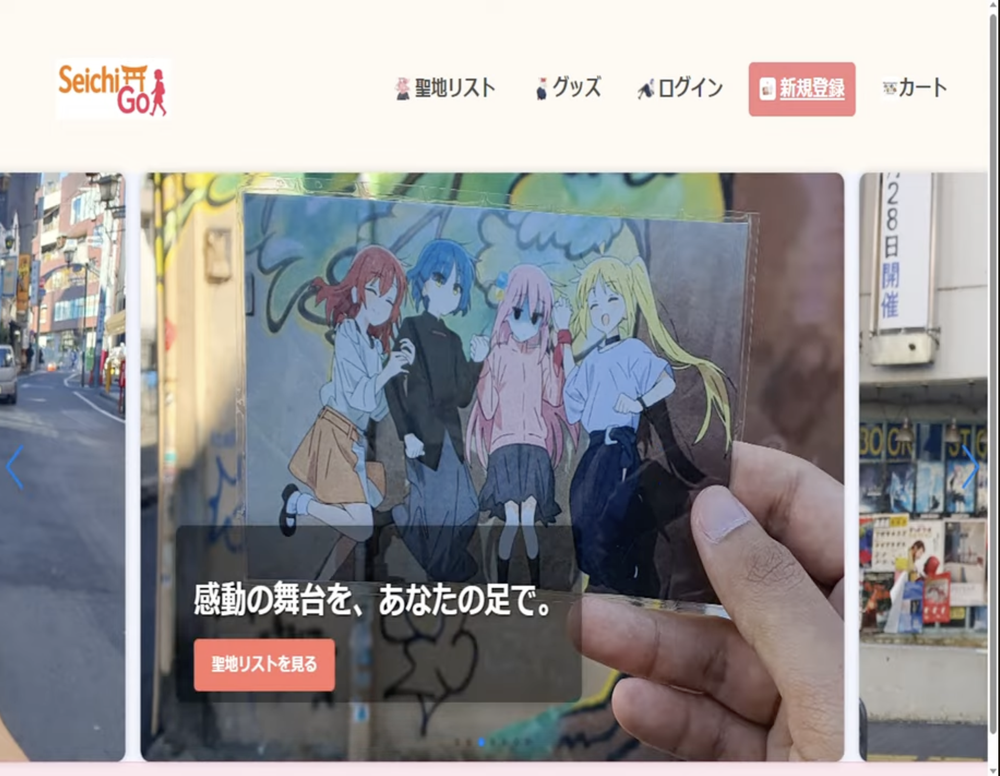
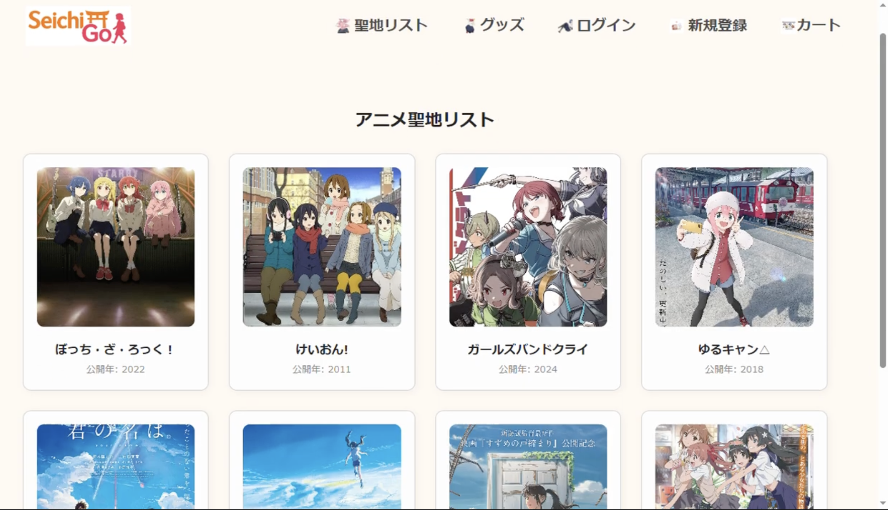
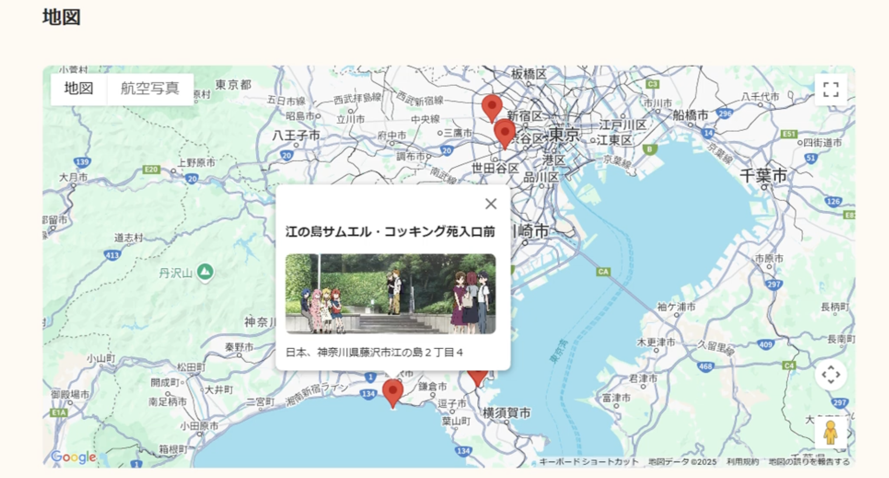
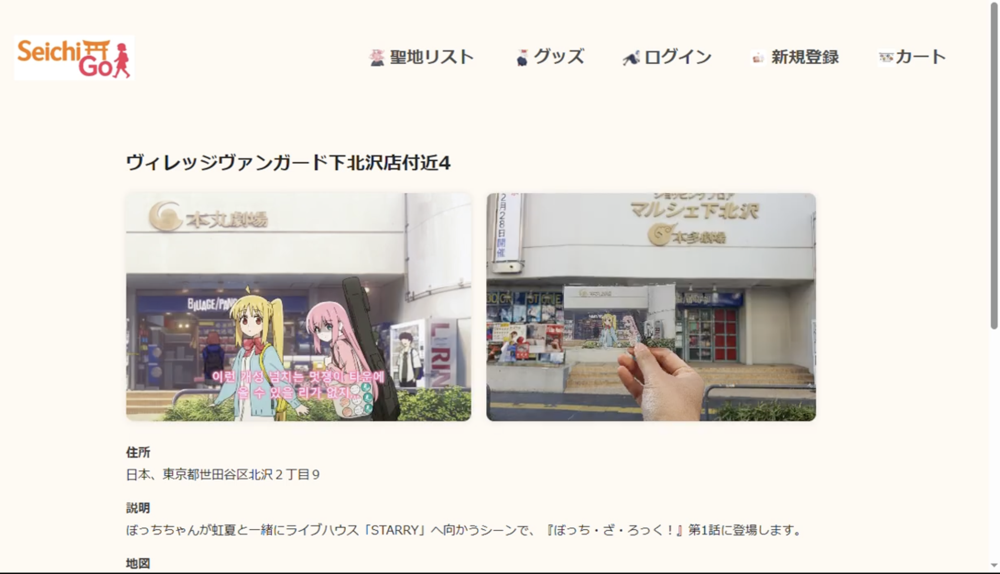
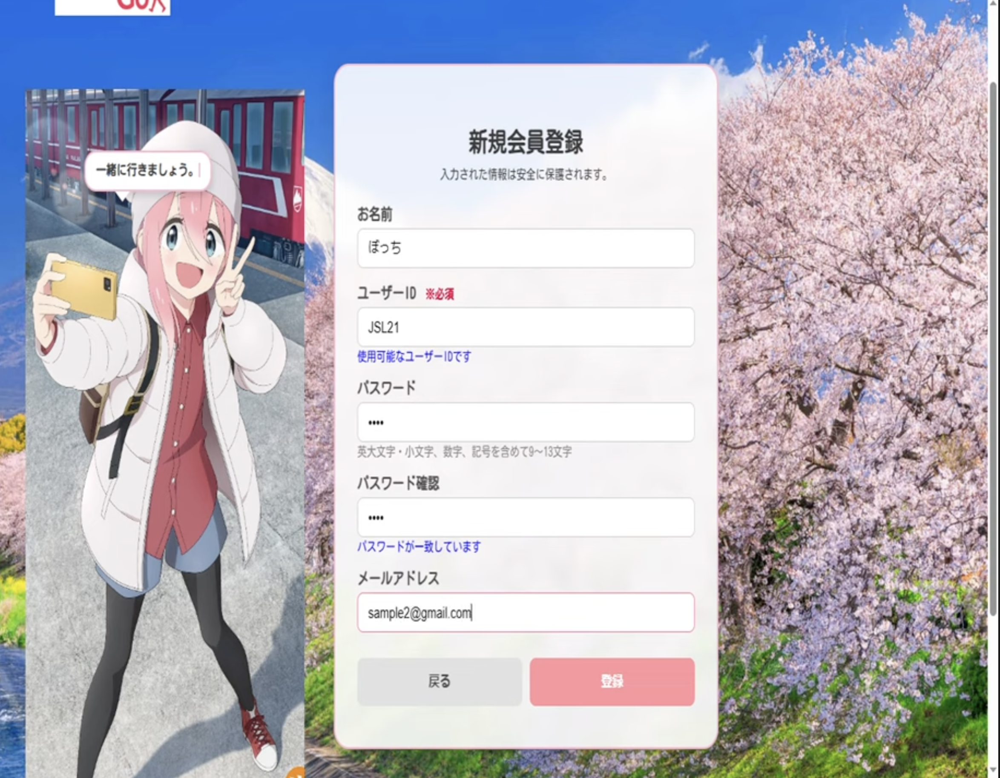
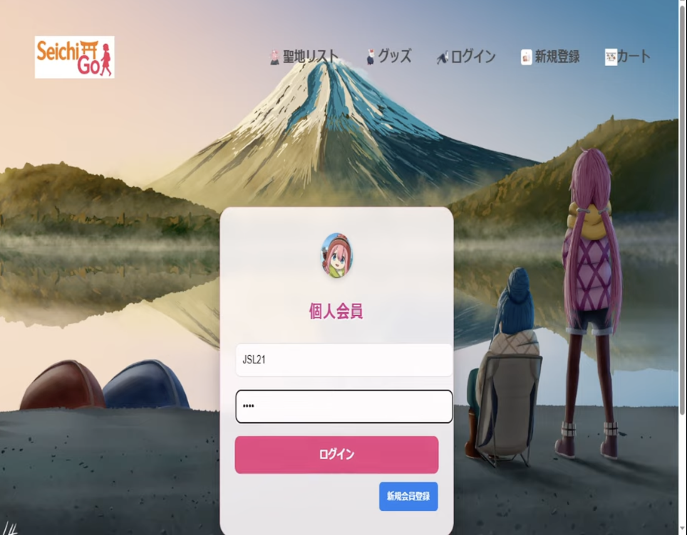
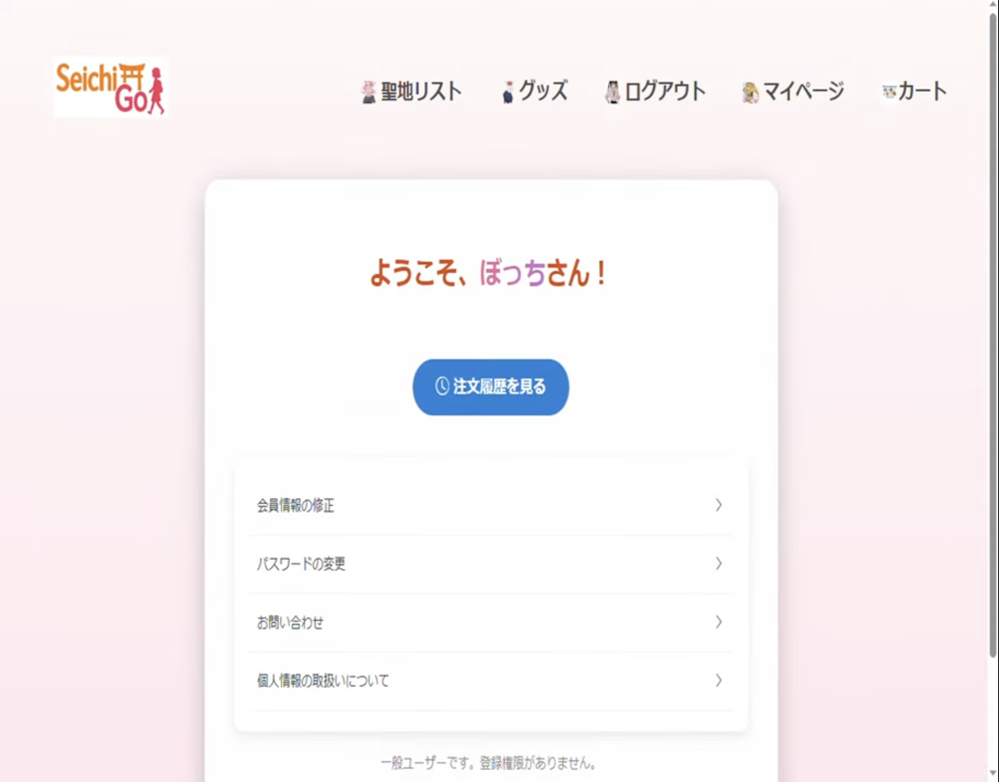

# SeichiGo

Spring Bootで開発したアニメ聖地巡礼・グッズ販売Webアプリケーションです。

## 📷 アプリケーション画面

### トップページ

### アニメ聖地リスト

### Google Mapsによる聖地表示
Google Maps APIを利用し、登録された聖地スポットを地図上にマーカーで表示します。
マーカーをクリックすると、スポット名・画像・住所を確認できます。

### 聖地スポット詳細
アニメ作品のシーンと実際の聖地写真、住所、スポット情報を表示します。

### 新規会員登録

### ログイン

### マイページ

## 概要

アニメ作品に関連する聖地スポットの情報を登録・表示し、関連グッズを閲覧・カートに追加できるWebアプリケーションです。

## 主な機能

- ユーザー登録・ログイン
- Spring Securityによる認証・認可
- アニメ作品一覧・詳細表示
- 聖地スポット登録・詳細表示
- Google Maps APIを利用した地図・マーカー表示
- 商品一覧・商品詳細表示
- カート追加・数量変更・削除
- 画像アップロード機能
- MyBatisによるMySQL連携

## 使用技術

- Java
- Spring Boot
- Spring Security
- Thymeleaf
- MyBatis
- MySQL
- HTML
- CSS
- JavaScript
- jQuery
- Google Maps API

## 担当・実装内容

- Controller / Service / Mapper構成によるWebアプリケーション実装
- 商品・カート・ユーザー・聖地情報のCRUD処理
- Spring Securityによるログイン処理
- DBに保存した緯度・経度情報をもとに地図上へマーカー表示
- MySQLテーブル設計
- 画像アップロード処理
